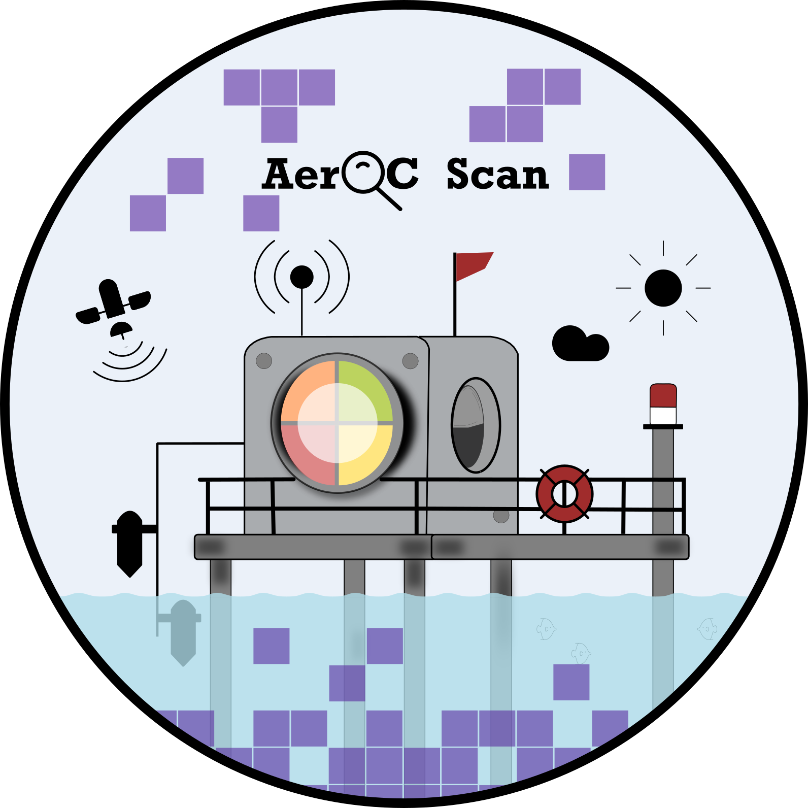

# AerOC Scan 

AerOC Scan is a Python package designed to download, filter, and correct AERONET-OC (Aerosol Robotic Network-Ocean Color) data. AERONET-OC comprises a global network of autonomous above-water radiometers located on fixed platforms in ocean, coastal, and inland waters. Here, nLW (normalized water-leaving radiance) measurements are selected based on the date and a timeframe of approximately 3-hours around the satellite overpass. These measurements are converted to Remote Sensing Reflectance and corrected according to the satellite spectral bands. In this version (v1), AerOC Scan supports Sentinel-2, Sentinel-3, Landsat-8/9, and PACE. 

## Requirements and Usage:
AerOC Scan is coded in Python 3 and requires Python packages to run: `numpy`, `pandas`, `geopandas`, `shapely`, `wget`, and `scipy`.

To run the AerOC Scan, it is necessary a suitable use the environment `aerocscan_env` by command line:

            conda env create -f aerocscan_env.yml
            conda activate aerocscan_env
            cd into the aerocscan directory
            python core.py

> AerOC Scan can also be run through the `aerocscan.ipynb` file.

## Input Parameters:
The AerOC Scan requires seven input data, including:  

* *dest*: output directory;
* *level*: AERONET-OC level (15 or 20);
* *start*: start date (yyyy-mm-dd);
* *end*: end date (yyyy-mm-dd);
* *id*: site id (or 'all');
* *local_time*: local time (hh:mm:ss);
* *sensor_type*: sensor type (S2A_MSI', 'S2B_MSI', S3A_OLCI', 'S3B_OLCI', 'L8_OLI', 'L9_OLI2', or 'PACE_OCI').

> The input parameters must be manually configured in the `core.py` or `aerocscan.ipynb` file.

## Output Parameters:
Outputs include: 0-rawdata (data from AERONET-OC), 1-shapefile (site locations in .shp), 2-plots (median spectra from AERONET-OC Rrs), 3-rrs_median (AERONET-OC Rrs classified with OWTs), and 4-X (Rrs spectra corrected by sensor).
